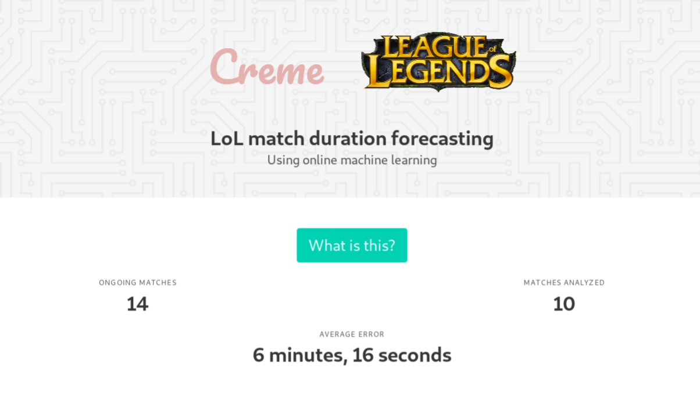
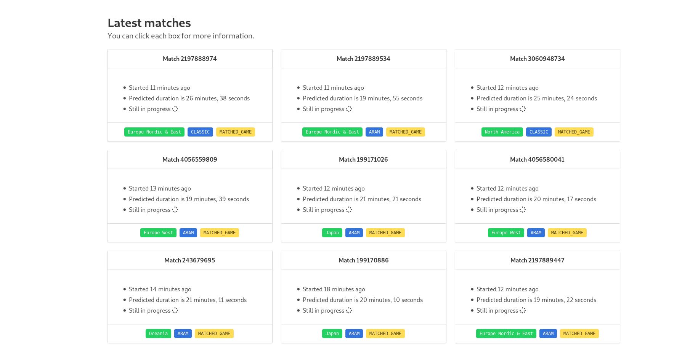

# League of Legends match duration forecasting

This is a simple project to demonstrate how `creme` may be used to build a "real-time" machine learning app. The idea is to predict the duration of LoL matches using information that is available at the start of the match. Once the match ends, the true duration is used to update the model.





## Architecture


The goal of this project is to demonstrate that online learning is easy to put in place. Indeed predicting and training are both done inside web requests.

- The model is stored in [`core/management/commands/add_models.py`](core/management/commands/add_models.py)
- Predictions happen in the `process_match` function of [`core/services.py`](core/services.py)
- Training happens in the `try_to_end_match` function of [`core/services.py`](core/services.py)
- The average error is computed in the `index` function of [`core/views.py`](core/views.py)

## Usage

### Development

Create an `.env` file with the following structure:

```sh
RIOT_API_KEY=https://developer.riotgames.com/
```

You first have to build the stack.

```sh
docker-compose build
```

You can then start the stack.

```sh
docker-compose -f docker-compose.yml -f docker-compose.dev.yml up -d
```

You only have to build the stack once. However you have to rebuild it if you add or modify a service. You can now navigate to the following pages:

- `localhost:8000` for the app
- `localhost:8082` for [Redis Commander](http://joeferner.github.io/redis-commander/)

Run `docker-compose down` to spin the stack down.

### Production

Create an `.env` file with the following structure:

```sh
SECRET_KEY=Keep_it_secret,_keep_it_safe
RIOT_API_KEY=https://developer.riotgames.com/
REDIS_PASSWORD=redis
ADMIN_PASSWORD=creme
```
